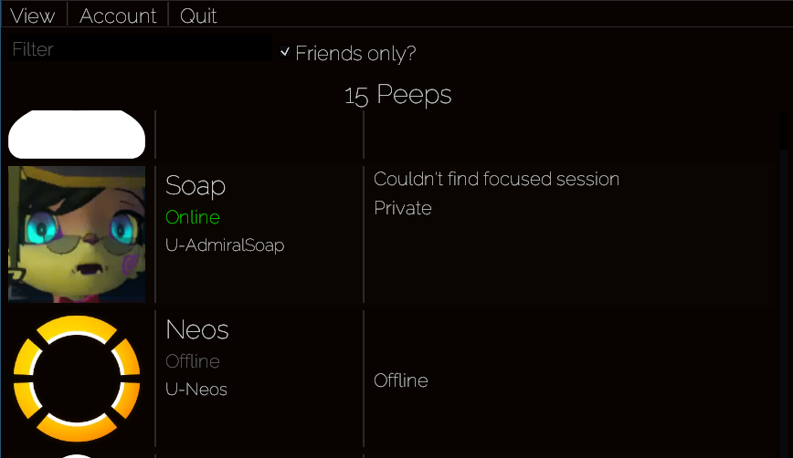
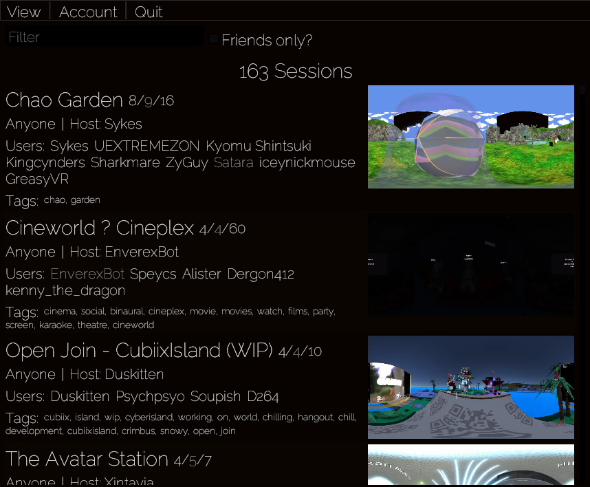
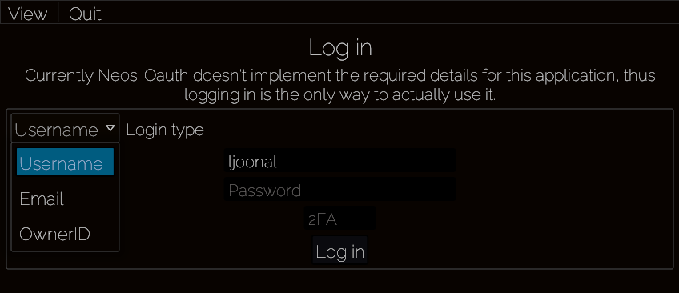
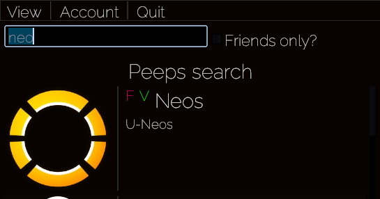
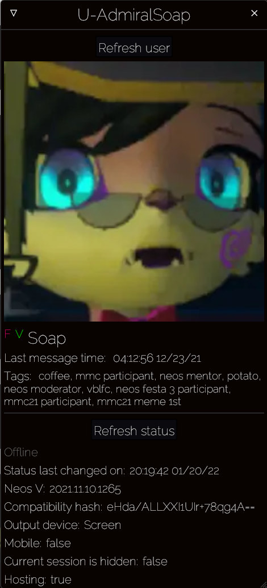
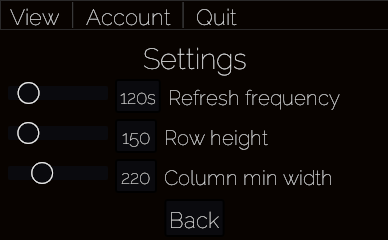

# Neos Peeps


NeosPeeps is tool that allows for listing your [NeosVR](https://steamcommunity.com/app/740250) friends quickly, without having to actually open the whole game. It also has a bunch of other features that you can find below, but that's how the project got it's name.

Please note that this app is quite experimental and unofficial. Bug reports are welcome!

## Features

All the following functionality, in under 5MB:

- Listing your friends, along the sessions that they're focused on.



- Listing the details of all public sessions, or only the ones that your friends are in



- Logging in, even with email or with 2fa enabled



- Searching the lists



- Showing details of a particular peep



- Refreshing the data in the background every so often
- Resizable grid



- CJK font support for all of you JP peeps (requires `Noto Sans CJK JP` font to be installed on the system)


## Installation & updating

Hop over to the [releases page](https://git.ljoonal.xyz/ljoonal/NeosPeeps/releases), and grab the latest `.zip` file and unzip the file.
There's no installer, so you might want to store the executable on your desktop for example.

Then just run the file.

You might get a warning about the executable not being signed.
Getting a signing certificate would cost a lot of money.
And I'm not willing to spend that much just for this hobby project.
If you're paranoid about the security, I welcome you to [build the app from source](#building) yourself.

## License

Note that the license is [AGPL](https://tldrlegal.com/license/gnu-affero-general-public-license-v3-(agpl-3.0)).
This is mainly meant to prevent anyone from commercializing this application.

In a short and non-legally binding way:
AGPL means that if you make changes and distribute the software, you will also have to provide the source code if asked for it.
In addition you'll need to provide the source code for any remote clients of the application if they ask for it.
You could technically sell it, but you'd still need to give out the source code if asked for it as well as build instructions, at which point, why would anyone pay you for it if they can just build it for free?

This isn't legal advice of course, just my interpretation of the license.

## Development

If you encounter bugs or have any other feedback, you can find me `ljoonal#2847` in the NeosVR discord as well as the Neos Modding discord server.

### Building

Requirements:

- [Git](https://git-scm.com)
- [Rust](https://www.rust-lang.org/)

Start off by cloning the project with git.

```sh
git clone https://git.ljoonal.xyz/ljoonal/NeosPeeps.git
```

Then open the project folder in your terminal, and just execute `cargo run` for a dev build.

See [build-release.sh](./build-release.sh) for building the releases on a standard linux distro.
If you have your own gitea server, [gitea-publish.sh](./gitea-publish.sh) is a handy script for automating creating the release.

### Contributing

In case you didn't know, git originally was used via email, and it still works just fine!
Check out [git-send-email.io](https://git-send-email.io) for a short tutoria.!
You can send patches to neos.git at ljoonal.xyz.

Although it might be easier for you to just message me.
I'm sure we can figure something out :)
